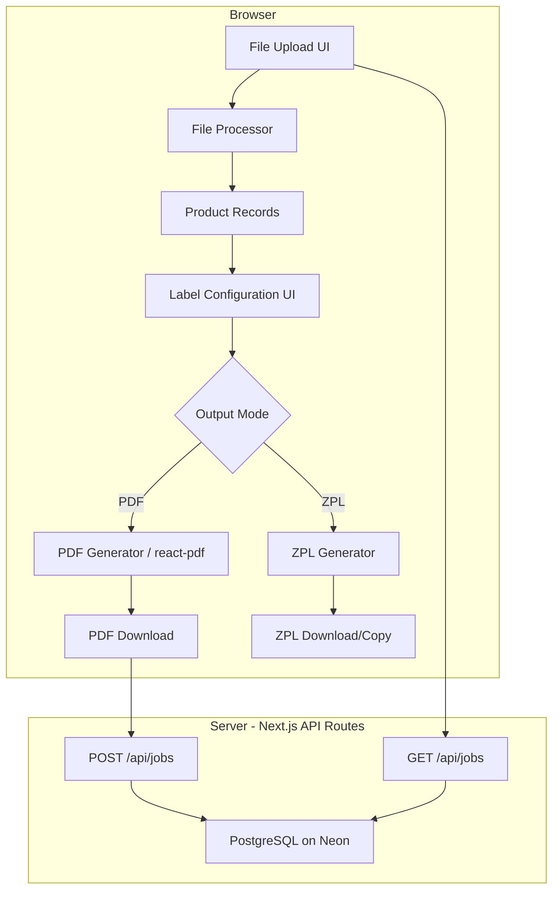

# Design Document: Barcode Label Generator

## Overview

This application is a Next.js (App Router) web app that accepts Excel/CSV file uploads containing product data and generates dimensionally accurate PDF barcode labels in a 2-up layout for Zebra thermal printers. An optional ZPL code generation mode is also supported. Job history is persisted to a PostgreSQL database on Neon.

The system is entirely client-side for file parsing and PDF generation, with server-side API routes only for job history persistence. This keeps the architecture simple and avoids uploading potentially sensitive product data to a server for processing.

### Key Design Decisions

1. **Client-side PDF generation**: react-pdf runs in the browser, so no server round-trip is needed for PDF creation. This reduces latency and simplifies deployment on Netlify.
2. **Client-side file parsing**: The xlsx library parses files in the browser, avoiding the need for server-side file handling or temporary storage.
3. **Server-side job persistence only**: Only lightweight job metadata (file name, row count, timestamp) is sent to the API route and stored in PostgreSQL. No product data is persisted.
4. **Point-based PDF dimensions**: react-pdf uses points (1 inch = 72 points). All label dimensions are expressed in points to ensure 1:1 physical accuracy on thermal printers.

## Architecture



### Data Flow

1. User uploads an Excel/CSV file via drag-and-drop or file picker.
2. The File Processor (client-side) parses the file using the `xlsx` library and produces an array of `ProductRecord` objects.
3. The user configures label content (toggle Product Name, SKU) and selects output mode (PDF or ZPL).
4. The PDF Generator uses `react-pdf` to compose a 2-up layout PDF with precise point-based dimensions. Alternatively, the ZPL Generator produces raw ZPL code strings.
5. On successful generation, job metadata is POSTed to `/api/jobs` and stored in PostgreSQL.
6. The main page fetches and displays previous jobs from `/api/jobs`.

## Components and Interfaces

### Page: `app/page.tsx` — Main Application Page

The single-page application containing all UI sections: file upload, configuration, output, job history.

### Component: `FileUploader`

Drag-and-drop file upload component with click-to-browse fallback.

```typescript
interface FileUploaderProps {
  onFileAccepted: (file: File) => void;
  onError: (message: string) => void;
}
```

- Accepts `.xlsx` and `.csv` files only.
- Displays file name + success indicator on valid drop.
- Displays error message on invalid file extension.
- Shows instructional text when no file is uploaded.

### Module: `fileProcessor`

Parses uploaded files into structured product data.

```typescript
interface ProductRecord {
  productName: string;
  sku: string;
  mrp: string;
  barcodeValue: string;
  rowNumber: number; // 1-based row index from the source file
}

interface ParseResult {
  records: ProductRecord[];
  warnings: string[]; // e.g., "Row 5: empty Barcode Value, skipped"
  errors: string[]; // e.g., "Missing columns: SKU, MRP"
}

function parseFile(file: File): Promise<ParseResult>;
```

- Uses `xlsx` library to read both `.xlsx` and `.csv` formats.
- Validates presence of required columns: Product Name, SKU, MRP, Barcode Value.
- Skips rows with empty Barcode Value, recording a warning.
- Returns an error if no valid rows remain after parsing.

### Component: `LabelConfigPanel`

UI for toggling label content fields and selecting output mode.

```typescript
interface LabelConfig {
  includeProductName: boolean; // default: true
  includeSku: boolean; // default: true
  outputMode: "pdf" | "zpl";
  dpi: 203 | 300; // only relevant for ZPL mode
}

interface LabelConfigPanelProps {
  config: LabelConfig;
  onChange: (config: LabelConfig) => void;
  zplEnabled: boolean; // feature flag for optional ZPL support
}
```

### Component: `LabelCanvas`

Renders a single label as a react-pdf `<View>` element.

```typescript
interface LabelCanvasProps {
  record: ProductRecord;
  config: LabelConfig;
  widthPt: number; // 144 (2 inches × 72 pt/inch)
  heightPt: number; // 72  (1 inch × 72 pt/inch)
}
```

- Renders barcode image using jsbarcode (pre-rendered to a data URL or SVG).
- Conditionally shows Product Name and SKU based on config.
- Always shows barcode image and MRP.
- Truncates product name with ellipsis if it exceeds label width.

### Module: `pdfGenerator`

Composes the 2-up layout PDF document using react-pdf.

```typescript
interface PdfGeneratorOptions {
  records: ProductRecord[];
  config: LabelConfig;
}

// Returns a react-pdf <Document> component or a Blob
function generatePdf(options: PdfGeneratorOptions): Promise<Blob>;
```

**Layout Constants (in points, 1 inch = 72 pt):**

| Dimension    | Inches | Points |
| ------------ | ------ | ------ |
| Page width   | 4.3    | 309.6  |
| Label width  | 2.0    | 144    |
| Label height | 1.0    | 72     |
| Column gap   | 0.125  | 9      |
| Left margin  | 0.0375 | 2.7    |

- Portrait orientation, no auto-scaling.
- Labels arranged in a 2-column grid.
- Odd label count: last label in left column, right column empty.

### Module: `zplGenerator`

Produces ZPL code strings for direct Zebra printer output.

```typescript
interface ZplOptions {
  records: ProductRecord[];
  config: LabelConfig;
  dpi: 203 | 300;
}

function generateZpl(options: ZplOptions): string;
```

- Uses `^PW832` for 203 DPI, `^PW1248` for 300 DPI.
- Generates one ZPL label block per ProductRecord.
- Respects label content configuration (Product Name, SKU toggles).

### API Route: `app/api/jobs/route.ts`

Server-side API for job history persistence.

```typescript
// POST body
interface CreateJobRequest {
  fileName: string;
  rowCount: number;
}

// GET response
interface JobRecord {
  id: string;
  fileName: string;
  rowCount: number;
  createdAt: string; // ISO 8601
}
```

### Component: `JobHistory`

Displays a list of previous label generation jobs.

```typescript
interface JobHistoryProps {
  jobs: JobRecord[];
  onSelectJob: (job: JobRecord) => void;
}
```

### Component: `PrintReminder`

Non-dismissible banner displayed after PDF generation.

```typescript
interface PrintReminderProps {
  visible: boolean;
}
```

- Instructs user to set Margins: None and Scale: 100% in browser print settings.

## Data Models

### Client-Side Models

```typescript
// Core product data extracted from a file row
interface ProductRecord {
  productName: string;
  sku: string;
  mrp: string;
  barcodeValue: string;
  rowNumber: number;
}

// Result of parsing an uploaded file
interface ParseResult {
  records: ProductRecord[];
  warnings: string[];
  errors: string[];
}

// Label rendering configuration
interface LabelConfig {
  includeProductName: boolean;
  includeSku: boolean;
  outputMode: "pdf" | "zpl";
  dpi: 203 | 300;
}
```

### Database Schema (PostgreSQL on Neon)

```sql
CREATE TABLE jobs (
  id UUID PRIMARY KEY DEFAULT gen_random_uuid(),
  file_name VARCHAR(255) NOT NULL,
  row_count INTEGER NOT NULL,
  created_at TIMESTAMPTZ NOT NULL DEFAULT NOW()
);

CREATE INDEX idx_jobs_created_at ON jobs (created_at DESC);
```

### API Models

```typescript
// POST /api/jobs request body
interface CreateJobRequest {
  fileName: string;
  rowCount: number;
}

// GET /api/jobs response item
interface JobRecord {
  id: string;
  fileName: string;
  rowCount: number;
  createdAt: string;
}
```

## Correctness Properties

_A property is a characteristic or behavior that should hold true across all valid executions of a system — essentially, a formal statement about what the system should do. Properties serve as the bridge between human-readable specifications and machine-verifiable correctness guarantees._

### Property 1: File extension validation

_For any_ file, the File Uploader should accept it if and only if its extension is `.xlsx` or `.csv`. All other extensions should be rejected with an error message.

**Validates: Requirements 1.1, 1.3**

### Property 2: File parsing round trip

_For any_ valid spreadsheet containing columns Product Name, SKU, MRP, and Barcode Value, parsing the file should produce an array of ProductRecord objects where each record's fields match the corresponding row's cell values.

**Validates: Requirements 2.1, 2.3**

### Property 3: Missing column detection

_For any_ subset of the required columns (Product Name, SKU, MRP, Barcode Value) that is absent from the uploaded file, the File Processor error message should list exactly those missing column names.

**Validates: Requirements 2.2**

### Property 4: Empty barcode row filtering

_For any_ dataset where some rows have empty Barcode Value fields, the parsed output should exclude those rows, and the warnings array should contain the row number of every skipped row.

**Validates: Requirements 2.4**

### Property 5: Label content respects configuration

_For any_ ProductRecord and any LabelConfig, the rendered label should contain the barcode image and MRP always, include the product name only when `includeProductName` is true, and include the SKU only when `includeSku` is true.

**Validates: Requirements 3.3, 3.4, 3.5**

### Property 6: Long product name truncation

_For any_ product name that exceeds the available label width, the rendered text should be truncated and end with an ellipsis character.

**Validates: Requirements 4.3**

### Property 7: PDF layout dimensions

_For any_ set of ProductRecords, the generated PDF should have a page width of 309.6 points (4.3 inches), label cells of exactly 144×72 points (2×1 inches), and a column gap of 9 points (0.125 inches).

**Validates: Requirements 4.1, 5.1, 5.2, 5.3**

### Property 8: Odd label count layout

_For any_ odd number of labels, the PDF layout should place the last label in the left column (index 0) with the right column empty.

**Validates: Requirements 5.4**

### Property 9: ZPL record count

_For any_ array of ProductRecords, the ZPL Generator should produce exactly one ZPL label block per record in the input array.

**Validates: Requirements 7.2**

### Property 10: ZPL DPI print width command

_For any_ DPI setting, the ZPL output should contain `^PW832` when DPI is 203, and `^PW1248` when DPI is 300.

**Validates: Requirements 7.3, 7.4**

### Property 11: Invalid barcode handling

_For any_ ProductRecord whose Barcode Value cannot be encoded by jsbarcode, the system should skip that label and include a warning referencing the affected row number.

**Validates: Requirements 8.2**

### Property 12: Job metadata persistence round trip

_For any_ successfully generated job, storing the job metadata (file name, row count, timestamp) via the API and then retrieving it should return the same metadata values.

**Validates: Requirements 9.1**

### Property 13: Job metadata display completeness

_For any_ JobRecord, when displayed, the rendered output should contain the file name, row count, and timestamp.

**Validates: Requirements 9.3**

## Error Handling

### File Upload Errors

| Error Condition            | Handling                          | User Feedback                                                                                    |
| -------------------------- | --------------------------------- | ------------------------------------------------------------------------------------------------ |
| Unsupported file extension | Reject file, do not process       | Error message listing accepted formats (.xlsx, .csv)                                             |
| File read failure          | Catch exception from xlsx library | Descriptive error: "Unable to read file. The file may be corrupted or in an unsupported format." |

### Parsing Errors

| Error Condition               | Handling                    | User Feedback                                              |
| ----------------------------- | --------------------------- | ---------------------------------------------------------- |
| Missing required columns      | Return error in ParseResult | Error listing each missing column name                     |
| Empty Barcode Value in a row  | Skip row, add to warnings   | Warning: "Row N: empty Barcode Value, skipped"             |
| Zero valid rows after parsing | Return error in ParseResult | Error: "No valid product data found in the uploaded file." |
| Unparseable file content      | Catch xlsx parse exception  | Error with reason from the parsing library                 |

### Label Rendering Errors

| Error Condition                   | Handling                                            | User Feedback                                                 |
| --------------------------------- | --------------------------------------------------- | ------------------------------------------------------------- |
| Invalid/unencodable barcode value | Skip label, add warning                             | Warning: "Row N: barcode value could not be encoded, skipped" |
| Product name overflow             | Truncate with ellipsis via CSS/react-pdf text style | No error — graceful truncation                                |

### PDF Generation Errors

| Error Condition             | Handling                       | User Feedback                   |
| --------------------------- | ------------------------------ | ------------------------------- |
| react-pdf rendering failure | Catch exception, display error | Error message with retry button |

### API / Database Errors

| Error Condition                   | Handling                                          | User Feedback                                           |
| --------------------------------- | ------------------------------------------------- | ------------------------------------------------------- |
| Job save failure (POST /api/jobs) | Catch, log server-side, do not block PDF download | Non-blocking warning: "Job history could not be saved." |
| Job fetch failure (GET /api/jobs) | Catch, show empty job list                        | Subtle message: "Unable to load job history."           |

### Error Handling Principles

1. **File processing errors are blocking** — the user cannot proceed to label generation if parsing fails.
2. **Row-level warnings are non-blocking** — valid rows are still processed; warnings are displayed alongside results.
3. **Database errors are non-blocking** — PDF generation and download should never fail because of a database issue.
4. **All errors include actionable guidance** — messages tell the user what went wrong and what to do next.

## Testing Strategy

### Unit Tests

Unit tests cover specific examples, edge cases, and integration points:

- **FileProcessor**: Parse a known .xlsx file with all columns present; parse a .csv with missing columns; parse a file with all-empty barcodes (zero valid rows edge case).
- **LabelCanvas**: Render a label with all fields enabled; render with Product Name disabled; render with SKU disabled; render with a very long product name (truncation).
- **PDF layout**: Generate PDF with 1 label (odd count); generate with 2 labels; generate with 0 labels (error case).
- **ZPL Generator**: Generate ZPL at 203 DPI and verify `^PW832`; generate at 300 DPI and verify `^PW1248`.
- **API routes**: POST a job and GET it back; handle database connection failure gracefully.
- **File extension validation**: Test .xlsx, .csv, .pdf, .txt, no extension.

### Property-Based Tests

Property-based tests use `fast-check` (the standard PBT library for TypeScript/JavaScript) with a minimum of 100 iterations per property.

Each property test references its design document property with a tag comment:

```
// Feature: barcode-label-generator, Property N: <property text>
```

Properties to implement as PBT:

1. **Property 1** — File extension validation: generate random file names, assert accepted iff extension is .xlsx or .csv.
2. **Property 2** — File parsing round trip: generate random tabular data with required columns, serialize to CSV, parse, and verify field equality.
3. **Property 3** — Missing column detection: generate random subsets of required columns to omit, verify error lists exactly those columns.
4. **Property 4** — Empty barcode row filtering: generate datasets with random empty barcode positions, verify filtered output and warning row numbers.
5. **Property 5** — Label content respects configuration: generate random ProductRecords and random LabelConfig booleans, verify rendered output contains exactly the expected fields.
6. **Property 6** — Long product name truncation: generate product names of random lengths exceeding label width, verify truncation with ellipsis.
7. **Property 7** — PDF layout dimensions: generate random-length ProductRecord arrays, verify page width, label cell dimensions, and gap in the PDF document structure.
8. **Property 8** — Odd label count layout: generate random odd-length arrays, verify last label is in left column.
9. **Property 9** — ZPL record count: generate random ProductRecord arrays, verify ZPL output contains exactly one label block per record.
10. **Property 10** — ZPL DPI print width command: generate random DPI selection (203 or 300), verify correct ^PW command in output.
11. **Property 11** — Invalid barcode handling: generate ProductRecords with invalid barcode values, verify they are skipped with appropriate warnings.
12. **Property 12** — Job metadata persistence round trip: generate random job metadata, POST then GET, verify equality.
13. **Property 13** — Job metadata display completeness: generate random JobRecords, verify rendered output contains all metadata fields.

### Test Configuration

- **Framework**: Jest or Vitest (aligned with Next.js project setup)
- **PBT Library**: `fast-check`
- **Minimum iterations**: 100 per property test
- **Test tagging**: Each property test includes a comment `// Feature: barcode-label-generator, Property {N}: {title}`
